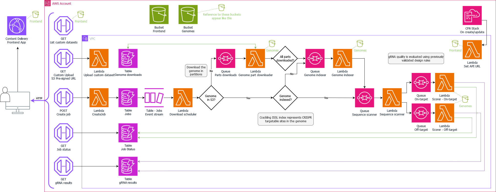

# Crackling Cloud (using Amazon Web Services)

[Crackling](https://github.com/bmds-lab/Crackling) is one of the leading CRISPR-Cas9 guide RNA design tools. 

In this implementation of Crackling, we use serverless technologies by Amazon Web Services (AWS) so anyone can design high-quality gRNA without having to send their data to a third-party.

With thanks to our colleagues at the CSIRO for their support during the development of this edition of the pipeline.

For support, contact Jake Bradford.

## As seen at...

**The International Conference for High Performance Computing, Networking, Storage, and Analysis (Supercomputing) 2024**

... in the Workshop: "WHPC: Diversity and Inclusion for All" ([abstract](https://sc24.supercomputing.org/proceedings/workshops/workshop_pages/ws_whpc124.html))

*Event-driven high-performance cloud computing for CRISPR-Cas9 guide RNA design*

Divya Joy<sup>1</sup>, Jacob Bradford<sup>1</sup>

<sup>1</sup> Queensland University of Technology, Brisbane, Australia 

**The Annual Conference of the Australian Bioinformatics and Computational Biology Society 2020**

*CRISPR, faster, better - The Crackling method for whole-genome target detection*

Jacob Bradford<sup>1</sup>, Timothy Chappell<sup>1</sup>, Brendan Hosking<sup>2</sup>, Laurence Wilson<sup>2</sup>, Dimitri Perrin<sup>1</sup>


<sup>1</sup> Queensland University of Technology, Brisbane, Australia 

<sup>2</sup> Commonwealth Scientific and Industrial Research Organisation (CSIRO), Sydney, Australia 

## Please cite us

Please cite our paper when using Crackling:

> Bradford, J., Chappell, T., & Perrin, D. (2022). *Rapid whole-genome identification of high quality CRISPR guide RNAs with the Crackling method.* The CRISPR Journal, 5(3), 410-421.

The standalone implementation is available on GitHub, [here](https://github.com/bmds-lab/Crackling).

# Architecture



# Deployment instructions

Coming soon: a short-cut method for deploying this infrastructure to your cloud account!

For now, read the *Development instructions* section.

# Development instructions

**Be sure you have cloned this repository to your computer.**

**1. Install the AWS command-line interface**

Follow the AWS Documentation for [Getting started with the AWS CLI](https://docs.aws.amazon.com/cli/latest/userguide/cli-chap-getting-started.html)

**2. Install the AWS Cloud Development Kit**

Follow the AWS Documentation for [Getting started with the AWS CDK](https://docs.aws.amazon.com/cdk/v2/guide/getting_started.html)

**3. Shared objects (for binaries)**

Collect all shared objects needed by compiled binaries.

See here: https://www.commandlinefu.com/commands/view/10238/copy-all-shared-libraries-for-a-binary-to-directory

Working in the root directory of the repo, run:

```bash
ldd layers/isslScoreOfftargets/isslScoreOfftargets | grep "=> /" | awk '{print $3}' | xargs -I '{}' cp -v '{}' layers/sharedObjects
```

then

```bash
ldd layers/rnaFold/rnaFold/RNAfold | grep "=> /" | awk '{print $3}' | xargs -I '{}' cp -v '{}' layers/sharedObjects
```

**4. Python Modules **

The `pip install -r' command is used frequently throught the following section. In some enviroments, this command errors out. If this occours, please view the requirments.txt file (referenced in the command) and use pip to install each library manually.

**PartLoader Layer**

Working in the root directory of the repository, run:

```bash
mkdir -p ./layers/requestsPy310Pkgs/python
python3 -m pip install --target layers/requestsPy310Pkgs/python requests
```

**Consensus Layer**

The consensus layer has Python dependencies, including scikit-learn. Scikit-learn along with its dependencies is over 250MB. To overcome the 250MB Lambda layer limit, these dependencies are being installed directly within the consensus Lambda and uploaded to S3. Hence, they do not need to be installed locally before deployment.

If you make changes to the dependencies, make sure the `requirements.txt` file is updated:

```bash
cd modules/consensus

pip freeze > requirements.txt
```

**NCBI Layer:**

Working in the root directory of the repo, run:
```bash
mkdir -p layers/ncbi/python
python3 -m pip install --target layers/ncbi/python -r layers/ncbi_reqs.txt
```

**AWS App Modules**

Working in the `<root>/aws` directory:
```bash
python3 -m venv .venv

source .venv/bin/activate

pip install -r requirements.txt

deactivate
```

**5. Further Reading**

Please now proceed to read the following documentation for futher install instructions (/understanding) for the application:
 - `<root>/layers/README.md`
 - `<root>/modules/README.md`
 - `<root>/aws/README.md`

**6. Deploying using the CDK**

Working from the `<root>/aws` directory:
```bash
# Run this during first deployment
cdk bootstrap aws://377188290550/ap-southeast-2
# Useful CDK commands include:
cdk synth # for creating the CloudFormation template without deploying
cdk deploy # for deploying the stack via CloudFormation
cdk destroy # for destroying the stack in CloudFormation
# add the `--profile` flag to indicate which set of AWS credentials you wish to use, e.g.  `--profile bmds`.
```
