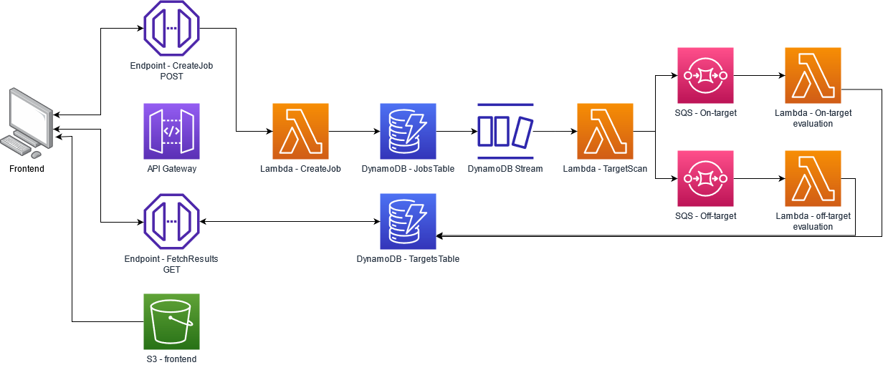

# Crackling AWS

This is a cloud-based implementation of the Crackling pipeline - for design of efficient and specific CRISPR Cas9 guides. 

Serverless technologies by Amazon Web Services (AWS) are used in this edition of the pipeline.

With thanks to our colleagues at the CSIRO for their support during the development of this edition of the pipeline.

For support, contact Jake Bradford.


This work was presented at the Annual Conference of the Australian Bioinformatics and Computational Biology Society (2020).

*CRISPR, faster, better - The Crackling method for whole-genome target detection*

Jacob Bradford<sup>1</sup>, Timothy Chappell<sup>1</sup>, Brendan Hosking<sup>2</sup>, Laurence Wilson<sup>2</sup>, Dimitri Perrin<sup>1</sup>
<sup>1</sup> Queensland University of Technology, Brisbane, Australia 
<sup>2</sup> Commonwealth Scientific and Industrial Research Organisation (CSIRO), Sydney, Australia 

## Preamble

The standalone implementation is available on GitHub, [here](https://github.com/bmds-lab/Crackling).

Please refer to our paper when using Crackling:

> **Faster and better CRISPR guide RNA design with the Crackling method**
>
> Jacob Bradford, Timothy Chappell, Dimitri Perrin
>
> bioRxiv 2020.02.14.950261; doi: https://doi.org/10.1101/2020.02.14.950261

> The design of CRISPR-Cas9 guide RNAs is not trivial, and is a computationally demanding task. Design tools need to identify target  sequences that will maximise the likelihood of obtaining the desired  cut, whilst minimising off-target risk. There is a need for a tool that  can meet both objectives while remaining practical to use on large  genomes.
>
> Here, we present Crackling, a new method that is more suitable for meeting these objectives. We test its performance on  12 genomes and on data from validation studies. Crackling maximises  guide efficiency by combining multiple scoring approaches. On  experimental data, the guides it selects are better than those selected  by others. It also incorporates Inverted Signature Slice Lists (ISSL)  for faster off-target scoring. ISSL provides a gain of an order of  magnitude in speed, while preserving the same level of accuracy.  Overall, this makes Crackling a faster and better method to design guide RNAs at scale.
>
> Crackling is available at https://github.com/bmds-lab/Crackling under the Berkeley Software Distribution (BSD) 3-Clause license.

## Architecture



## Crackling-AWS Deployment Guide

### 1. Installing and Configurung the AWS CLI in Linux/WSL
```bash
# Check for updates
$ sudo apt-get update

# install aws cli
$ sudo apt-get install awscli

# configure aws credentials (config and cred files can be found in . ~/aws (hidden files) in linux/windows)
# Use the following settings:
# 	ACCESS KEY: <yourAWSAccessKey>
# 	SECRET KEY: <yourAWSSecretKey>
# 	REGION: ap-southeast-2
# 	TYPE: json
$ aws configure
```

### 2. Installing AWS-CDK in Linux or WSL

Using VSCode as your Integrated Development Environment is recommended.

AWS provides documentation that you should read:

- [Configuration and credential file settings](https://docs.aws.amazon.com/cli/latest/userguide/cli-configure-files.html) (for the AWS CLI - we set the up in the above step)

- [Getting started](https://docs.aws.amazon.com/cdk/v2/guide/getting_started.html) (with the CDK)

- [Working with the AWS CDK in Python](https://docs.aws.amazon.com/cdk/v2/guide/work-with-cdk-python.html)

- [The AWS Python API documentation is provided here](https://docs.aws.amazon.com/cdk/api/v1/python/index.html)

- There is a vscode AWS plugin that you may find useful: `amazonwebservices.aws-toolkit-vscode` 

   ```
    Name: AWS Toolkit
    Id: amazonwebservices.aws-toolkit-vscode
    Description: Amazon Web Services toolkit for browsing and updating cloud resources
    Version: 1.36.0
    Publisher: Amazon Web Services
    VS Marketplace Link: https://marketplace.visualstudio.com/items?itemName=AmazonWebServices.aws-toolkit-vscode
   ```

Follow these instructions to setup the environment.

```bash
# Install Node Version Manager (nvm)
$ curl -o- https://raw.githubusercontent.com/nvm-sh/nvm/v0.39.1/install.sh | bash

# Using nvm, install node v18 (aws cdk is not supported on newer versions)
$ nvm install v18.0

# Install the AWS CDK
$ npm install -g aws-cdk

# Check the AWS cdk is executable
$ cdk --version
> 2.15.0 (build 151055e)

# Make sure python3.8 venv is installed
$ sudo apt-get install python3-venv
```

### 3. Shared objects (for binaries)

Collect all shared objects needed by compiled binaries.

See here: https://www.commandlinefu.com/commands/view/10238/copy-all-shared-libraries-for-a-binary-to-directory

Working in the root directory of the repo, run:
```
ldd layers/isslScoreOfftargets/isslScoreOfftargets | grep "=> /" | awk '{print $3}' | xargs -I '{}' cp -v '{}' layers/sharedObjects

ldd layers/rnaFold/rnaFold/RNAfold | grep "=> /" | awk '{print $3}' | xargs -I '{}' cp -v '{}' layers/sharedObjects
```

### 4. Python Modules 

The `pip install -r' command is used frequently throught the following section. In some enviroments, this command errors out. If this occours, please view the requirments.txt file (referenced in the command) and use pip to install each library manually.

**Consensus Layer**

The consensus module has Python dependencies that need to be installed. They need to be installed and packaged locally before deploying to AWS.

Working in the root directory of the repo, run:
```
mkdir ./layers/consensusPy38Pkgs/python
python3 -m pip install --target layers/consensusPy38Pkgs/python -r modules/consensus/requirements.txt
```

Read more in the AWS documentation: https://docs.aws.amazon.com/lambda/latest/dg/python-package.html#python-package-dependencies

If you make changes to the dependencies, make sure the `requirements.txt` file is updated:

```bash
cd modules/consensus

pip freeze > requirements.txt
```

**NCBI Layer:**

Working in the root directory of the repo, run:
```bash
mkdir layers/ncbi/python
python3 -m pip install --target layers/ncbi/python -r layers/ncbi_reqs.txt
```

**AWS App Modules**

Working in the `<root>/aws` directory:
```bash
   python3 -m venv .venv

   source .venv/bin/activate

   pip install -r requirements.txt

   deactivate
```

### 5. Further Reading
Please now proceed to read the following documentation for futher install instructions (/understanding) for the application:
 - `<root>/layers/README.md`
 - `<root>/modules/README.md`
 - `<root>/aws/README.md`

### 6. Deploying using the CDK
Working from the `<root>/aws` directory:
```bash
# Run this during first deployment
cdk bootstrap aws://377188290550/ap-southeast-2
# Useful CDK commands include:
cdk synth # for creating the CloudFormation template without deploying
cdk deploy # for deploying the stack via CloudFormation
cdk destroy # for destroying the stack in CloudFormation
# add the `--profile` flag to indicate which set of AWS credentials you wish to use, e.g.  `--profile bmds`.
```
